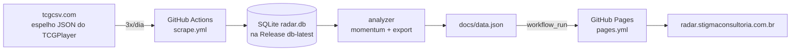

# Banzai Radar — Arquitetura & Guia do Desenvolvedor

Documento de onboarding tecnico. Para instalacao passo a passo, veja o `README.md`.

## O que e

Sistema de inteligencia de mercado para a Banzai Cards. Monitora precos de cartas de **One Piece TCG (OPTCG)** e **Gundam Card Game (GCG)** no TCGPlayer e detecta *spikes* (altas de preco) antes das lojas brasileiras reagirem — permitindo comprar cartas subvalorizadas para revenda. Foco em cartas individuais (nao produtos selados).

Dashboard publico: **radar.stigmaconsultoria.com.br**

## Fluxo de dados

Ponto-chave: **o banco NAO fica versionado no git**. Ele vive como asset de Release (tag `db-latest`); o git so carrega o `docs/data.json` (pequeno). Isso evita inchar o historico com um binario que cresce a cada coleta.

## Stack

- **Python 3.13** (coleta e analise)
- **GitHub Actions** (automacao, 3x/dia)
- **SQLite** (`radar.db`, armazenado na Release)
- **GitHub Pages** (dashboard estatico)
- **tcgcsv.com** (fonte — espelho gratuito do TCGPlayer, JSON, sem auth)

## Mapa de arquivos

| Caminho | Papel |
|---|---|
| `collect.py` | Orquestrador. `run()`: cria schema -> raspa -> grava snapshots -> exporta `data.json`. Tambem `upsert_card` e `save_price`. |
| `scraper/tcgplayer.py` | Consome o tcgcsv (em lote por *set*), monta cada carta (nome, set, raridade, precos). |
| `analyzer/momentum.py` | Calcula variacoes 24h/7d, momentum, status; `get_top_movers`, `get_opportunities`. |
| `analyzer/export_static.py` | Gera o `docs/data.json` (radar + oportunidades + stats). |
| `db/models.py` | Conexao SQLite (WAL) e criacao do schema (`init_db`). |
| `docs/index.html` | Dashboard (HTML/JS puro, le `data.json`). |
| `docs/.nojekyll` | Desliga o Jekyll pra servir HTML puro. |
| `.github/workflows/scrape.yml` | Workflow de coleta (cron BRT + manual). |
| `.github/workflows/pages.yml` | Workflow de deploy (via `workflow_run`). |
| `api/main.py` | API FastAPI — **so uso local**, nao roda em producao. |
| `debug_inspect.py` | Utilitario de debug avulso. |

## O pipeline em detalhe

### scrape.yml — Coleta de Precos
Agenda: `17 9,15,21 * * *` no fuso `America/Sao_Paulo` (~09:17 / 15:17 / 21:17 BRT; minuto 17 pra fugir do pico do cron) + disparo manual. Passos:
1. Checkout do repo.
2. Setup Python 3.13.
3. **Restaurar** `radar.db` da Release `db-latest` (`gh release download`). Na primeira vez, comeca vazio.
4. `pip install -r requirements.txt`.
5. `python collect.py` (raspa, grava snapshots, exporta `data.json`).
6. **Podar** snapshots > 60 dias + `VACUUM`.
7. **Publicar dashboard**: commita SO o `docs/data.json` na `main` (`git pull --rebase --autostash`).
8. **Salvar banco**: sobe `radar.db` de volta pra Release (`gh release upload --clobber`), fora do git.

### pages.yml — Publicar Dashboard
Dispara `on: workflow_run` **apos** a Coleta concluir (nao `on: push`). Motivo: o push da coleta usa o `GITHUB_TOKEN`, e **push com GITHUB_TOKEN nao dispara workflows `on: push`** (regra anti-recursao do GitHub). O `workflow_run` contorna isso. Publica o `docs/` no GitHub Pages.

## Modelo de dados (SQLite)

- **cards**: `id`, `name`, `set_code`, `game` (OPTCG/GCG), `rarity`, `tcg_url`, `product_id` (unico), `active`.
- **price_snapshots**: `id`, `card_id`, `price` (= midPrice), `market_price`, `low_price` (menor anuncio), `high_price` (maior anuncio), `source`, `captured_at`.
- **watchlist**, **events**: reservados / uso futuro.

O preco oficial dos calculos e o **`market_price`** (valor de mercado do TCGPlayer, derivado de vendas recentes). `low_price`/`high_price` sao o menor/maior anuncio.

## Como a coleta funciona

Nao raspamos a pagina do TCGPlayer carta a carta. Puxamos do **tcgcsv**, que serve tudo em JSON **em lote por set**. Para cada jogo (categoria) -> cada set (group) -> duas chamadas (`/prices` e `/products`) trazem o set inteiro; juntamos por `productId`.

Por carta, pegamos a **variante de maior `marketPrice`** (Normal/Foil/etc.) — cartas raras as vezes so tem preco no Foil, entao filtrar so Normal descartaria as mais valiosas.

## Decisoes e pegadinhas (nao repetir erros)

- **URLs do tcgcsv** exigem prefixo `/tcgplayer/`.
- `productTypeName` sempre vem `None` nesse mirror — nao confiar.
- **E carta?** `is_card = bool(rarity)` + exclusao por nome (starter deck, booster box...).
- **Nome do set** vem do laco de groups (`gname`), **nao** de cada produto (o tcgcsv nao repete `groupName` por carta). `upsert_card` atualiza `set_code`/`name`/`rarity` (backfill).
- **Banco fora do git** (Release) pra nao inchar o historico. Restaura -> usa -> re-sobe.
- **Deploy via `workflow_run`** por causa da regra anti-recursao do `GITHUB_TOKEN`.
- **Radar por jogo**: `get_top_movers` roda 120x OPTCG + 120x GCG, pra um jogo nunca sumir do radar num dia de mercado parado.
- **Migracao idempotente de schema** no `collect.py` (`PRAGMA table_info` + `ALTER TABLE`), pra bancos antigos restaurados da Release ganharem colunas novas (ex.: `high_price`).
- **GitHub Pages** exige repo publico + `docs/.nojekyll`.
- **`data.json` em UTF-8** (`ensure_ascii=False`).

## O dashboard (docs/index.html)

HTML/JS puro que le `data.json`. Duas abas: **Radar** (top movers) e **Oportunidades** (menor anuncio vs. mercado). No Radar: filtro por **jogo**, **piso de preco**, **Colecoes** (multi), **Raridade** (multi) e **Ordenacao** (Top Spike Delta24h padrao / Momentum / Maior preco / Maior queda). Colunas: Carta, Jogo, Preco atual->24h, Delta24h, Delta7d, Momentum, Status, Menor anuncio, Maior anuncio.

## Rodando localmente

1. Python 3.13 + `pip install -r requirements.txt`.
2. `python collect.py` — raspa e gera `docs/data.json`. (Local comeca de um `radar.db` vazio, sem o restore da Release; os deltas 24h/7d so ficam ricos com historico acumulado.)
3. Abrir `docs/index.html` (ou servir a pasta `docs/`) pra ver o dashboard.
4. `api/main.py` (FastAPI) e opcional, so pra dev — nao roda em producao.

## Limitacoes conhecidas

- **Sem ultima venda**: o tcgcsv expoe market/low/mid/high, nao o preco da ultima venda. O `market_price` e o proxy baseado em vendas recentes.
- **Raridade vazia** em muitas cartas (~2,2k) — audit do `is_card` pendente.
- **Delta24h/7d** dependem de historico acumulado pra terem significado.
- **`.db` antigos no historico do git** (de antes da migracao pra Release) — recuperar o espaco exige reescrita de historico (destrutiva).

## Roadmap / itens abertos

- Auditar `is_card` (raridade vazia).
- Ranking do radar por `max(Delta24h, Delta7d)` (robusto a dias parados).
- Limiar alto de spike so pra comuns/incomuns.
- Estender filtros (colecao/raridade/ordenacao) a aba Oportunidades.
- Reescrita de historico do git.
